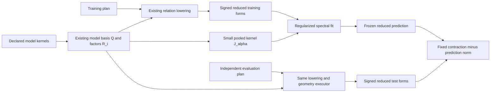

# Predictive geometry: code review and implementation plan

Date: 2026-09-04 (America/Toronto). Status: proposal, not a replacement for the
current normative contract. Review task: `bd-01M1QEQT094PQ808NV6H71E697`.

Follow-up: the [granular work packages](2026-09-04-predictive-geometry-work-packages.md)
and [test specification](2026-09-04-predictive-geometry-test-specification.md)
supersede this document's broad sequencing and provisional API-preservation
choice. The user clarified that the existing partial implementation is
context, not a design constraint. The source review below remains useful
evidence; the new plan explicitly re-evaluates that implementation's APIs.

**Recommendation: retain the model-coordinate compiler, make the learned form
the prediction object, and add an explicit fit/score boundary.** The refined
proposal supplies a coherent statistical objective. Most of the difficult
execution infrastructure already exists in this working tree. The substantive
work is kernel semantics, training lineage, and predictive scoring.

Review baseline: `elite-pass`, HEAD
`1d93c857ec240154541e4c6283fa5542912e0f8a`, plus existing uncommitted work.
`R/model-basis.R` and `R/model-geometry.R` are untracked additions in this
checkout. The live model-coordinate epic has M1–M9 closed and M10–M12 open
and deferred. Its certification report records the earlier implementation;
it does not certify the estimator proposed here. This review changes no
production code, existing contract, or certification artifact.
The live source-tree digest was rechecked after the review and remains
`sha256:24afa8ce392d71efa930c2dcb0afd9ac0951d100a424965c5a89a949355f1a8d`,
matching the existing report's source binding. This is an identity check,
not a rerun of its benchmark gates.

**What the code already provides**

| Existing seam | Finding and disposition |
|---|---|
| `R/model-basis.R:318,667` | Declared squared-Euclidean RDMs and feature matrices; centered, rank-revealing factors; per-model spectra and ranks; typed extractor and effect-map products. Keep this construction. Add explicit kernel input and normalization. |
| `R/model-basis.R:764,835` | Construction refuses overlapping spans; validation assumes square `R` and zero overlap. This restriction serves coefficient identification, not form prediction. Move it to the readers that need identified model coefficients. |
| `R/relation.R:578` | `.relation_lowered()` composes `Q'` with each partition's extractor, preserving the sources. This is the required factorized pullback, already implemented. |
| `R/evidence-task.R:466` | The lowering gate admits the declared linear stages and refuses nonlinear edge transformations. Retain the gate. |
| `R/model-geometry.R:454,657` | The current view materializes a reduced geometry, separately queries centered/orthogonal traces, and fits one of four structures. Extract preparation into a shared helper; a predictive fit should not incur the extra trace execution. |
| `R/model-geometry.R:350` | Cross-fitting uses declared disjoint edges, but fits a rank-s **projector** and reads `tr(V' S_test V)`. It does not retain amplitudes or compute predictive risk improvement. Keep its name and meaning distinct. |
| `R/latent.R:283,323` | Reusable spectral PSD/rank truncation and accounting. The scalar rank validator currently excludes zero. Reuse the numerical operation, with a deliberate zero-rank extension; do not reuse the descriptive receipt as a prediction receipt. |
| `R/primitives.R:288,319` | `svec` uses sqrt(2) off-diagonal scaling. Packed dot products already equal Frobenius products, which makes score evaluation simple and exact. |
| `R/result.R:612`; `R/geometry-entry.R:63` | Reduced forms can use existing memory/block storage and row reads. A new spectral executor is unnecessary. |
| `R/relation.R:759`; `R/receipt.R:28` | Source revisions, extractor definitions, domain identity, plan identity and execution receipts exist. They provide provenance ingredients, not a proof of training/test independence. |
| `R/views.R:658` | RSA remains a fixed linear RDM-regression query. Leave it unchanged. Its unconstrained coefficients are not equivalent to nonnegative additive-kernel fitting. |

The measurement-form extractor defect already tracked as
`bd-01M1Q62WMQVY1S210CH8ZH9J2H` is outside this geometry route. Track it
separately; do not make this feature depend on repairing an unused executor.

**The algebra to build around**

Use the existing model factors, now allowing a rectangular factorization:

\[
T=[T_1,\ldots,T_m]=QR,\qquad R=[R_1,\ldots,R_m].
\]

`Q` is an orthonormal basis for the union of the retained model spans. It is
fixed from model data alone. Normalize each retained kernel explicitly; for
unit retained trace, replace `T_i` by `T_i / sqrt(sum(T_i^2))`. Record the
original scale, retained trace, truncation, negative-mass policy, and the
normalization rule. Normalize **after** model-rank truncation for this
convention. Do not quietly substitute normalization by the original trace.

The pooled model kernel in these coordinates is

\[
J_\alpha=\sum_i\alpha_i R_iR_i^\top,\quad
K_\alpha=QJ_\alpha Q^\top,\quad
\alpha_i\ge0,\quad\sum_i\alpha_i=1.
\]

Compute `S_x = Q' G_x Q` through the existing lowered relation. For fixed
per-model truncations, this compression can be reused across weights,
penalties and response ranks. Changes to the model-rank specification can
initially create a new prepared geometry; a later maximal-basis cache can
cover nested truncations if measurements justify it.

For zero weights or redundant directions, diagonalize the **positive support**
of the small pooled kernel:

\[
J_\alpha=UDU^\top,\qquad D\succ0.
\]

The fitted form in union coordinates is

\[
\widehat A_x
=U[U^\top S_xU-\lambda D^{-1}]_{+,s}U^\top,
\qquad \widehat F_x=Q\widehat A_xQ^\top.
\]

This is the exact solution of the user's stated penalized Frobenius loss.
Do not subtract a diagonal penalty in an arbitrary `Q` basis: only the
pooled-kernel eigenbasis diagonalizes that penalty. When all weights are
positive on a full union support, one may equivalently use
`[S_x - lambda * solve(J_alpha)]_{+,s}`. When `J_alpha` is singular, merely
subtracting its pseudoinverse in the full union space is **wrong**: it leaves
unsupported directions unpenalized and can fit them. Restrict the range first.

This permits overlapping models without attempting to invert a rectangular
`R`. There is no need to identify a separate coefficient for every redundant
feature. Store the invariant fitted form through a reduced factor; never
describe its arbitrary factor columns as unique model contributions.

For a frozen fit, evaluate

\[
\Delta_x=2\langle\widehat A_x,S_{test,x}\rangle_F
                 -\|\widehat A_x\|_F^2.
\]

All scoring algebra uses existing symmetric packed coordinates or small
matrix products. One spatially varying fitted operator does not require a
new public measurement-specific query-bank type: compute the common reduced
test forms and contract each row with its fitted form. For a single frozen
operator, its full-space lift is also an ordinary `bilinear_query()`.



**A small public surface**

Keep `model_basis()` as the reusable declaration and add two verbs. The
following is a proposed interface; `kernels`, `normalize`, `fit_geometry`
and `score_geometry` are not current functionality.

```r
basis <- model_basis(
  kernels = list(visual = K_visual, semantic = K_semantic),
  conditions = relation$effect_space,
  rank = c(visual = 8L, semantic = 5L),
  normalize = "trace"
)

fit <- fit_geometry(
  train_plan, basis,
  weights = c(visual = 0.5, semantic = 0.5),
  rank = 4L,
  penalty = chosen_penalty
)

evidence <- score_geometry(fit, test_plan)
```

The first supported validation route should use two plans restricted to
disjoint partition sets of the **same declared parent relation**, on the same
conditions and spatial measurements. Both pairings must state the requisite
independence assumptions. General cross-dataset admission comes after lineage
support, not through a boolean bypass.

Keep the existing RDM and feature entry routes, with their explicit distance
convention. Kernel input must have named/aligned axes, finite symmetric
values, an explicit centering rule, and PSD admission. Model PSD repair must
be reported; a rank-one kernel plus silent negative-mode deletion should not
be advertised as the originally supplied kernel.

Use one scalar nonnegative rank budget in the first public call, including
`rank = 0L`, and a required finite nonnegative penalty. Named weights must
match the models exactly and satisfy the simplex convention; do not silently
renormalize a malformed declaration. The numerical helper should support
reuse across a rank path, but automatic tuning is a later orchestration step.

Return an `effect_geometry_fit` whose useful fields are:

- Frozen prediction in reduced coordinates: orthonormal modes, amplitudes,
  requested/effective rank, pooled-kernel support and index.
- Signed training forms, preferably a reference to their existing block
  store, plus the small kernel declaration needed to interpret them.
- Explicit training diagnostics: subspace residual, prediction norm squared,
  regularization cost and the objective up to its identified constant.
- An immutable training record: selected hyperparameters, selection origin,
  partition/observation support, source revisions, basis identity and target
  estimand. Exact record names should follow the package's sealed schema style.
- Parent execution receipts and a separate fit record. The existing execution
  receipt is sealed and should not absorb an open list of statistical metadata.

Return an `effect_geometry_score` with per-measurement `gain`,
`evidence_inner_product`, `prediction_norm_sq`, optional mode/group evidence,
training and evaluation identities, and an explicit validation record.
`as.data.frame()` should foreground gain and effective rank. Do not name it
`R2`, variance explained, unbiased geometry, or an inference result.

A fitted form may later support explicit `predict()`/RDM views. It should not
inherit `effect_geometry` and thereby acquire methods whose contracts assume
raw crossvalidated estimates. Avoid materializing a condition-by-condition
prediction array unless the caller requests it.

**Scientific and numerical decisions that must be explicit**

1. **Saturation moves from constructor refusal to fit interpretation.** A
   full centered span with zero penalty is model-agnostic for this shared
   estimator. Permit its use as a clearly labelled generic baseline, while
   disallowing a model-specific interpretation. With positive penalty,
   anisotropic kernels can make different predictions even at full span.
   Report span and kernel conditioning; do not call every full-span fit
   vacuous. Compare against a matched isotropic kernel on the same span to
   establish that model geometry adds value beyond generic shrinkage/rank
   reduction. Positive gain against zero alone does not establish that.

2. **The source stays signed.** Fit the shifted compressed form, without
   first clipping the neural geometry. Keep the spectrum of `S`, the spectrum
   of the shifted form, and fitted amplitudes conceptually distinct. Negative
   mass of the shifted form includes the penalty's effect; it is not the
   negative mass of the neural estimate. Reuse truncation numerics, not
   misleading moved-mass labels from a different transformation. Generic
   kernel and response matrices need not commute, so regularization can
   rotate eigenvectors as well as shrink amplitudes.

3. **The exact loss is Frobenius loss on a declared effect space.** Centered
   condition coordinates with common units/scales are the initial target.
   Arbitrary rescalings or nonorthogonal effect reparameterizations change
   this loss. Do not imply that the same eigensolver solves unweighted RDM
   regression or general GLS. A score through a fixed observation-map
   adjoint is a later extension, with its own loss declaration.

4. **Rank zero and positive eigenvalue ties are real cases.** Rank zero
   produces the zero predictor and exactly zero gain. A positive tie across
   a model truncation or fitted-rank boundary can make even the fitted form
   nonunique. Detect it at a declared tolerance and refuse that ambiguous
   truncation in the first version, with a remedy to choose a rank outside
   the tied group. Ties entirely inside the retained spectrum preserve the
   form, but mode-wise test evidence depends on the chosen basis; report
   tied-subspace evidence as a group. Sign fixing alone does not solve ties.

5. **Three identities serve different purposes.** Retain exact coordinate
   identity for compatible execution, normalized kernel/form semantics for
   scientific interpretation, and source/training identity for provenance.
   Test rotational equivalence numerically after changing coordinates;
   do not promise bitwise equal hashes from different floating-point
   eigendecompositions. Do not hash an arbitrary latent factor as though
   changing its rotation changes the prediction.

6. **Conditional unbiasedness is the evaluation assumption.** The desired
   theorem requires `E[G_test | all fitting and selection information] = G*`.
   Verify known overlap using actually used pairing endpoints and their
   source/observation lineage, not every source stored in the parent plan,
   filename differences, partition labels alone, or unequal plan hashes.
   Carry the declared assumptions; hashes cannot prove independence.
   Relabelling reused data must not bypass the check. Unknown lineage is an
   unsupported independent-evidence claim, not an invitation to pass
   `fixed = TRUE`. Training records must also include any selection of
   weights, ranks, penalty, feature transforms, and neural metric.

7. **Matching estimands does not mean matching plan IDs.** The training and
   test pairings necessarily differ. Compare effect coordinates, units,
   normalization, domain/frame identity, component and fixed metric;
   separately validate the disjoint support and generalization declaration.
   Match measurements by their stable identities, never just row counts.
   Initially reject mismatched frame/measurement targets rather than invent
   a spatial transport for learned forms.

8. **A scalar score is not an automatic standard error.** Keep gain signed.
   Under a pure-noise target, conditional expected gain is
   `-prediction_norm_sq`; the current cross-fitted projector energy instead
   has null expectation zero. Overlapping cross-validation edges are not
   independent replicates. Do not calculate an IID standard error over them
   or reuse latent-spectrum uncertainty claims. Any population inference
   must specify its sampling unit and account for shared training.

9. **Add evidence, count the prediction norm once.** A single frozen fit can
   read coherent and configuration evidence, whose linear terms add to the
   total. Two separately fitted forms do not generally add. Two complete
   component gains computed against the same fit would subtract its squared
   norm twice. Expose additive evidence components and one total gain.
   Likewise, fitting an aggregate differs from aggregating fitted forms.

10. **Scale belongs to the model specification.** With unit-trace model
    kernels, penalty has the units of the neural geometry. If neural effect
    units are `u`, geometry and penalty have units `u^2`, while Frobenius gain
    has units `u^4`. Global penalties across spatial measurements are a
    substantive scale choice. Any adaptive rescaling must be learned within
    training and recorded. Compressed forms identify neither the absolute
    full-space sample residual nor an unbiased signal-energy denominator.

11. **Plan-time inspection is separate from data use.** The current relation
    family signature covers every source in the parent relation, and matrix
    source hashes include their labels. Those are useful integrity records,
    but are not canonical observation-lineage keys. A predictive record needs
    actual training dependencies in addition to the parent signature. Hashing
    an evaluation source for integrity is not fitting on its outcomes;
    conversely, relabelling/repacking shared observations must not make them
    independent. The same-parent restriction keeps this first admission
    problem bounded while a more general origin manifest is developed.

**Implementation sequence and acceptance gates**

| Step | Concrete change | Acceptance gate |
|---|---|---|
| P1. Freeze the revised contract | Amend `model-coordinate-v1` through a versioned successor or explicit versioned amendment. Resolve overlap, saturation, normalization, rank/ties, score units and validation semantics. Preserve the old implementation/evidence as the comparison baseline. | The objective, admitted input types, null expectations and refusals are unambiguous. Tests for old and new estimands are not silently rewritten to conflate them. |
| P2. Generalize the model declaration | Extend `R/model-basis.R` with explicit kernel input, declared normalization and rectangular `R`; update validators, extractor identities and numerical tolerance records. Move inverse/identifiability gates into old coefficient readers. | Duplicate/overlapping models are admitted for pooled-form prediction; label permutations align; input rescaling under trace normalization preserves kernels; centered and rank-deficient cases remain stable. Old coefficient readers refuse unsupported nonidentifiability explicitly. |
| P3. Add the pure estimator and plan preparation | Add layer-5 `R/geometry-fit.R`; share a small lowered-plan preparation helper with the existing view. Pool in small coordinates, restrict positive support, shift, call the PSD/rank primitive, retain a reduced prediction. Skip original-space trace queries. | Full-space and reduced-route fits agree on independent dense fixtures, including noncommuting penalties, overlap, zero weights/rank, near singularity and ties. Zero penalty reproduces the existing shared numerical projection on admitted inputs. No change to RSA or native geometry kernels. |
| P4. Add frozen scoring with lineage checks | Add layer-5 `R/geometry-score.R`, separate fit/score records, and same-parent-relation disjoint-partition admission. Keep record validators in a one-way dependency shared by fit/score as needed. | Exact packed/dense and mode/group gain identities; reject reused/renamed observations, mismatched effects/metrics/measurements, or undeclared independence; match conditional risk under planted signal and pure noise. Scoring never reselects rank or drops negative-gain modes. |
| P5. Make validation useful | Demonstrate a fixed train/test split first. Then extract the current pairing-driven edge schedule into shared internal infrastructure and reuse the same fitter/scorer per fold. Add an inner-selection example for weights/rank/penalty, followed by untouched outer evaluation. | Fold results retain actual training/evaluation support and weights. Four disjoint partitions suffice for a fixed-hyperparameter train-edge/test-edge example; nested tuning requires its own feasible split, not a universal four-partition promise. Repeated folds assess an algorithm at their training size, not the final all-data refit. |
| P6. Bound memory and demonstrate scientific value | Use current block stores and `geometry_component(..., rows=)` to consume reduced forms in row blocks. Retain O(r*s) prediction factors per measurement, not redundant model-coordinate coefficient arrays. Cache reduced data/spectra within a fixed declared training fold. Build a simulation and reader-first example. | Measure source reads, wall time and peak RSS against matched full-form and current view routes; demonstrate model-specific benefit against a same-span isotropic baseline, and negative gain from overfit modes. Do not claim a speedup from coordinate counts alone. |
| P7. Integrate and certify | Register files in the architecture test; update API tiers and public API registry before generated exports; document vocabulary, migration and examples; run the relevant checks and existing recertification sequence once the source is stable. | Zero new upward edges/cycles; old estimands retain their tests; new independent numerical/statistical checks pass; full tests/R CMD check pass or report specific remaining problems; certification artifacts bind to the final source digest. |

Dependency order is P1 → P2 → P3 → P4 → P5 → P6 → P7. The numerical
contract checks can be developed alongside P2, but public scoring should not
ship before P4's admission rules exist. The smallest useful complete slice
is P1–P4 plus a documented fixed split: named kernels → fitted form → honest
held-out gain, with fixed rank/weights/penalty and fixed neural metric.

Avoid extending the four-structure optimizer taxonomy during this work.
Keep the current `model_geometry()` behavior and its projector-energy field
as an advanced descriptive diagnostic during migration; route new predictive
examples through fit/score. Decide its later consolidation after the new
slice works. Its isotropic nonnegative fit and existing `rsa()` are different
objectives, so deleting one on the assertion that the other replaces it
would lose functionality.

Keep learned/whitened metric schedules outside the first predictive slice,
consistent with current lowering admission. A metric learned on training
data and frozen for evaluation is a viable later target, but its conditional
estimand and residual-channel provenance need their own review.

**Deferred extensions, in order**

Condition hold-out (existing M10) is the next scientific extension after a
working independent-partition score. It needs training-defined centering,
feature scaling, truncations and a cross-kernel, not just condition indices
passed to the current pairing. Store the transformations needed to reproduce
the cross-kernel. Use the minimum-norm continuation
`F_BB = L F_AA L'`, `L = K_BA K_AA^+`, with training-defined kernels and,
when the test geometry is centered over B, apply that same target centering
to the prediction. Never independently truncate/normalize the test kernel
and call that an inductive application of the trained model.

Known model features for all conditions can be a valid transductive design,
but that is a different declaration from learning every transform on training
conditions. Neither independence of runs nor disjoint condition labels alone
guarantees conditional independence of noisy train/test geometries; reuse
of noisy observations, shared preprocessing and shared fitted nuisance
quantities must be accounted for.

General observation-space/GLS loss (M11) follows only with a declared
observation map and admitted covariance capability. Its generic fit needs a
different solver; its frozen evaluation still compiles by the adjoint.
`sampling_covariance()` already supplies a restricted query-bank route, not
generic selected-eigenvalue inference. Freeze any scoring precision with the
other training-derived quantities.

Review M12 rather than automatically implementing it as a second optimizer:
for fixed features and this Frobenius objective, the proposed shared
`T W W' T'` form with minimum-norm penalty is already solved by the spectral
estimator. Truly additional nonlinear feature learning remains a separate
training procedure with its own provenance.

**Evidence collected for this review**

- Ran `NOT_CRAN=true Rscript -e 'testthat::test_local(".",
  filter="model-basis|model-coordinate|model-geometry|latent-geometry|architecture|api-surface",
  reporter="summary")'`. All seven selected test files completed successfully.
  Startup locale warnings and a testthat build-version warning were emitted;
  no test failures were reported. This was not a full-suite or release run.
- Added the base-R-only mathematical check
  [2026-09-04-predictive-geometry-checks.R](2026-09-04-predictive-geometry-checks.R)
  and its [output](2026-09-04-predictive-geometry-checks.txt). Seed 20260904;
  no package calls in the algebra check. Overlap/zero-weight pooled fits
  agreed with full-space fits within 4.5e-15. A noncommuting example's
  spectral optimum agreed with the best of 12 numerical factor optimizations
  within 5.2e-13 (a numerical cross-check, not a proof of global optimality).
- Adjoint, codec, mode sum and exact paired-noise risk identities agreed
  within 1.6e-14. In 5,000 independent cross-product null simulations, mean
  gain was -0.670983 versus predicted -0.667839; the identity error was
  -0.00314325 with Monte Carlo standard error 0.0141352. The null is negative
  for nonzero predictions; this experiment is not a population-inference test.
- Live Mote confirmed M1–M9 closed, M10–M12 deferred/open, and no active
  reservations before this review. Historical progress-file test totals
  were not treated as fresh verification. Only this bounded review task was
  added; P1–P7 are proposed work packages, not yet tracker commitments.

The second-moment organization of encoding, PCM and RSA is established in
[Diedrichsen and Kriegeskorte (2017)](https://journals.plos.org/ploscompbiol/article?id=10.1371/journal.pcbi.1005508).
Feature-reweighted RSA already uses nested selection and condition-wise
generalization; see [Kaniuth and Hebart (2022)](https://pure.mpg.de/pubman/item/item_3384829_3/component/file_3451207/Kaniuth_2022.pdf).
The architecture recommended here is an inference from the reviewed source
and the supplied objective: crossform can represent a learned form as a
frozen observable with an auditable evaluation boundary. Establishing novelty
of the statistical estimator itself would require a broader literature review.
