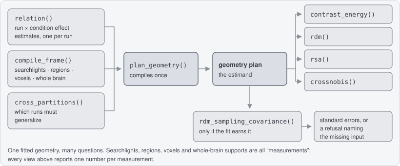
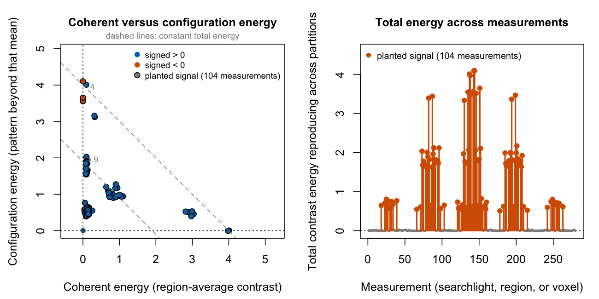
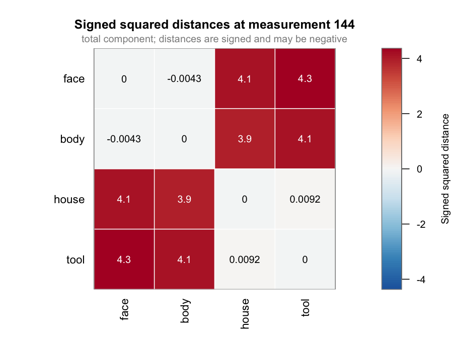

# crossform

Ask a task-fMRI dataset four questions from one fit, and find out what *kind*
of effect you found.



You declare the condition effects, the measurements you want answers at, and
which runs must generalize. That compiles once into a **geometry plan**, which
records the quantity you are estimating before any brain data is read.
Contrasts, RDMs, RSA, and crossnobis distances are queries against it.

A **measurement** is a spatial unit: a searchlight, a region, a voxel, or the
whole brain. Every result has one row per measurement.

## Five lines to a first result

```r
library(crossform)

example <- example_fmri_effects()   # 4 conditions, 4 runs, 280 searchlights

plan <- plan_geometry(
  example$fit$relation,
  at   = example$frame,
  over = cross_partitions(
    example$fit$relation,
    independence     = "independent",
    generalizes_over = "run"
  )
)

effect <- contrast_energy(plan, example$contrast)
plot(effect,
  highlight       = example$truth$signal_measurements,
  highlight_label = "planted signal"
)
```



The fixture plants two animate-versus-inanimate blocks of 19 voxels each, at
opposite ends of the volume, with the same per-voxel amplitude. In one the sign
alternates between neighboring voxels, so the block's average pattern nearly
cancels. In the other every voxel shifts the same way. The analysis is not told
where either is; `highlight` only colors the answer afterwards.

The right panel is the whole map. The 104 largest energies in it are exactly
the 104 searchlights that touch a planted block, and the largest energy
anywhere else is `0.03`, against `4.10` at the peak. The rest lies *on* zero
rather than above it, 45% of it below, because crossvalidated energy is
centered at zero under the null and negatives are kept rather than clipped.
That band is the noise floor itself. The left panel splits the same energy in
two, and the two blocks separate: one arm climbs the vertical axis, the other
runs out along the horizontal.

Every object prints as itself.

```r
effect
#> <effect_contrast_view>
#>   measurements: 280
#>   contrast:     face 0.5, body 0.5, house -0.5, tool -0.5
#>  measurement    signed   coherent configuration      total coherence_fraction
#>            1 -0.106479  0.0070182    -6.660e-03  0.0003580                 NA
#>            2 -0.014663 -0.0022348     1.516e-02  0.0129223                 NA
#>            3  0.058211  0.0012974    -3.917e-03 -0.0026194                 NA
#>            4  0.019986 -0.0005859    -6.015e-05 -0.0006461                 NA
#>            5  0.029592 -0.0002906     1.334e-02  0.0130512                 NA
#>            6 -0.003182 -0.0009076     4.846e-03  0.0039387                 NA
#>   ... 274 more measurements
#>   coherence_fraction: 143 of 280 valid; NA where coherent and configuration
#>     are not a nonnegative partition

peak <- which.max(effect$total)

round(c(
  searchlight   = peak,
  signed        = effect$signed[peak],
  total         = effect$total[peak],
  coherent      = effect$coherent[peak],
  configuration = effect$configuration[peak]
), 3)
#>   searchlight        signed         total      coherent configuration
#>       144.000        -0.052         4.103        -0.001         4.104
```

The last line of that print is not boilerplate. `coherence_fraction` is `NA` in
those first rows because the two components do not form a nonnegative partition
there, and a share of a negative quantity is not a share of anything.

One line in the first block deserves a second look. `cross_partitions()` pairs
every partition with every other one, once. `generalizes_over` names the axis
those partitions *are* — runs, sessions, tasks — and binds it into the plan's
identity, because cross-run and cross-session reproduction are different
quantities at the same fold count; if your partitions are sessions, pass
`"session"`. `independence = "independent"` declares that the partitions'
estimation errors are independent, which separate runs or sessions with
separate noise satisfy; omit it and you keep a point estimate but earn neither
cross-generalized nor analytic-uncertainty capabilities. See
`?cross_partitions`, and `?pairing` for nested or directed designs.

## Now change the question. No refit.

`plan` holds an identity, not a matrix.

```r
plan
#> <effect_geometry_plan>
#>   effects:      4 x 4
#>   measurements: 280
#>   features:     280
#>   metric:       implicit identity
#>   generalizes:  6 partition pairs over run, endpoints independent
#>   execution:    query-first, in memory
#>   state:        nothing computed yet
#>   next:         contrast_energy(plan, weights), rdm(plan), rsa(plan)
```

Save it with the analysis record; it names the conditions, domain, frame, run
pairs, metric, and units. Nothing is computed until a view asks, and
`print(plan, detail = TRUE)` adds the compiler's own account of how it will do
it.

```r
distances <- rdm(plan)
plot(distances, measurement = peak)
```



At searchlight 144, face and body are `-0.004` apart and house and tool
`0.009`, while every animate-versus-inanimate pair is above `3.8`. Nothing
asked for that block structure.

```r
category <- rsa(plan, models = list(category = example$model_rdm))
dim(category$coefficients)
#> [1] 280   2
```

Linear RSA against a model RDM, from the same plan: an intercept and the model.

```r
one_pair <- rdm(plan, pairs = rbind(c("face", "house")))
dim(one_pair$values)
#> [1] 280   1
```

One of the six pairs; the other five are never materialized. With 100
conditions, three of the 4,950 pairs cost three pairs.

`rdm()` reports $d_{ij} = G_{ii} + G_{jj} - 2G_{ij}$: under cross-run pairing a
signed crossvalidated squared Euclidean distance, and squared Mahalanobis
(crossnobis) once you supply a fixed neural metric. It is deliberately not
`1 - Pearson correlation`; see the
[correlation-distance policy](https://bbuchsbaum.github.io/crossform/articles/correlation-distance-policy.html),
or `vignette("correlation-distance-policy")` offline.

## What kind of effect is it?

That left panel is the part that is hard to get elsewhere. A searchlight's
reproducible energy splits in two:

- **`coherent`** is the energy carried by the searchlight's frame-weighted
  average pattern, which is the familiar univariate story;
- **`configuration`** is the reproducible spatial pattern beyond that mean;
- `coherent + configuration = total`, exactly, at every measurement, which is
  why the dashed guides are lines of constant total. The panel is drawn on
  equal axes so those guides really do run at slope -1.

So you can say how much of an effect survives once its regional mean is
accounted for, without a second analysis and without discarding either part.

The fastest way to see it is to ask the same question of three regions instead
of 280 searchlights. Nothing changes but the frame.

```r
truth  <- example$truth
labels <- rep("elsewhere", example$domain$n_features)
labels[truth$planted_features] <- "pattern block"
labels[truth$mean_features]    <- "mean-shift block"

region_plan <- plan_geometry(
  example$fit$relation,
  at   = compile_frame(regions(labels), example$domain),
  over = cross_partitions(
    example$fit$relation,
    independence = "independent", generalizes_over = "run"
  )
)
contrast_energy(region_plan, example$contrast)
#> <effect_contrast_view>
#>   measurements: 3
#>   contrast:     face 0.5, body 0.5, house -0.5, tool -0.5
#>       measurement  signed  coherent configuration    total coherence_fraction
#>         elsewhere 0.01205 0.0001184      0.002417 0.002535            0.04669
#>  mean-shift block 2.01677 4.0671067     -0.006716 4.060391                 NA
#>     pattern block 0.51791 0.2678235      3.808338 4.076161            0.06570
#>   coherence_fraction: 2 of 3 valid; NA where coherent and configuration are
#>     not a nonnegative partition
```

The two blocks reproduce almost exactly the same total, `4.06` and `4.08`, and
the split is opposite: the mean-shift block puts all of it in `coherent`, the
pattern block puts 93% of it in `configuration`, and the rest of the brain
reproduces `0.003`. That is the central claim, in three rows. The mean-shift
block's fraction is not reported because its configuration remainder came out
very slightly negative, which is the honest answer for a block that has no
pattern beyond its mean.

Back at searchlight resolution: every one of the 52 searchlights touching the
pattern block carries more configuration than coherent energy, and the largest
coherent energy among them is `0.33` against `4.10` of configuration. The 52
touching the mean-shift block reach `4.01` of coherent energy while their
configuration never exceeds `1.27`.

`signed`, back in that first table, is a first moment: the ordinary contrast of
the region-average pattern, in your effect's units and sign. The energies are
second moments, squared and crossvalidated. So `signed` sees only the coherent
half — which is exactly what separates the two blocks.

```r
round(as.data.frame(effect)[c(144, 137),
  c("signed", "coherent", "configuration", "total")], 3)
#>     signed coherent configuration total
#> 144 -0.052   -0.001         4.104 4.103
#> 137  2.003    4.011         0.004 4.015
```

Two searchlights, one from each block, reproducing the same energy. Searchlight
137 is loud in a signed map. Searchlight 144 — the strongest measurement in the
whole volume — has a signed contrast of `-0.052`, smaller than the largest
signed value anywhere outside the planted blocks (`0.154`), so a signed map
ranks the best result in the volume below noise.

Most toolboxes ask you to choose first: remove the regional mean and the
coherent half is gone, keep it and the two are summed into one number.
[Reading the results](https://bbuchsbaum.github.io/crossform/articles/interpreting-results.html)
(`vignette("interpreting-results")`) covers the traps in the coherent share.

## Bring your own data

If you already have one condition-by-voxel beta matrix per run, this is the
whole path. It runs as written.

```r
set.seed(1)
conditions <- c("face", "house", "cat", "chair")

mask  <- array(TRUE, c(8, 8, 6))                       # substitute your mask
dom   <- volume_domain(mask, spacing = c(3, 3, 3))
frame <- compile_frame(searchlights(radius = 4), dom)

# Substitute your betas: one condition-by-voxel matrix per run, rows named.
# Twelve voxels here carry the same face-minus-house pattern in every run,
# alternating in sign so the regional mean stays near zero.
planted <- array(FALSE, dim(mask))
planted[3:4, 3:5, 3:4] <- TRUE
pattern <- rep(c(3, -3), length.out = sum(planted))

betas <- lapply(1:4, function(run) {
  b <- matrix(rnorm(4 * sum(mask)), 4, sum(mask), dimnames = list(conditions, NULL))
  b["face",  planted[mask]] <- b["face",  planted[mask]]  + pattern
  b["house", planted[mask]] <- b["house", planted[mask]] - pattern
  b
})
names(betas) <- paste0("run", 1:4)

rel      <- relation(betas, effects = effect_space(conditions), domain = dom)
own_plan <- plan_geometry(rel, at = frame, over = cross_partitions(
  rel, independence = "independent", generalizes_over = "run"
))

own_effect <- contrast_energy(own_plan, c(face = 1, house = -1, cat = 0, chair = 0))
plot(own_effect)
```

The same story on "your" data. Did the searchlights that actually touch the
planted voxels win?

```r
touching <- which(Matrix::rowSums(frame$weights[, planted[mask], drop = FALSE]) > 0)
ranked   <- order(own_effect$total, decreasing = TRUE)

c(
  searchlights          = nrow(frame$index),
  touching_signal       = length(touching),
  top_energies_touching = sum(ranked[seq_along(touching)] %in% touching),
  peak_energy           = round(max(own_effect$total), 2),
  largest_elsewhere     = round(max(own_effect$total[-touching]), 2)
)
#>          searchlights       touching_signal top_energies_touching
#>                384.00                 44.00                 44.00
#>           peak_energy     largest_elsewhere
#>                 27.48                  1.29
```

The 44 largest energies in the map are exactly the 44 searchlights that touch
the planted voxels. Every one of them is configuration-dominated, and 48% of
the rest fall below zero.

Swap `searchlights(radius = 4)` for `regions(labels)`, `voxelwise()`, or
`whole_brain()`, and `volume_domain()` for `abstract_domain(n_features)` when
the features are not a volume. `neuroim2` users have
`neuroim2_volume_domain()`, `neuroim2_searchlights()`, and `as_neurovol()`,
which keep stable full-volume indices and map results back without
interpolation; see `vignette("neuroim2-data")`. Starting from scan-by-feature
responses instead? Use `study()`, `plan_relation()`, and `estimate_relation()`.

### Reading a map without ground truth

`highlight` is optional — the call above omits it — and the picture still
works. In the right panel the band around zero *is* the noise floor, because
crossvalidated energy is centered there when nothing reproduces; candidates are
the measurements standing clear of it. In the left panel each candidate then
declares its kind: high on the vertical axis is a reproducible pattern, far
along the horizontal axis is a regional mean.

What the picture does not give you is a threshold or a p-value. `crossform`
does no spatial and no group inference (see [Status and scope](#status-and-scope)),
and a within-measurement standard error needs the residual channel, so fit with
`lm_relation_fit()` or the
[from-observations](https://bbuchsbaum.github.io/crossform/articles/from-observations.html)
route (`vignette("from-observations")`) rather than importing betas.
[Reading a map without ground truth](https://bbuchsbaum.github.io/crossform/articles/interpreting-results.html#reading-a-map-without-ground-truth)
is the longer version.

## Uncertainty, only when it is earned

`example_fmri_effects()` was built by `lm_relation_fit()`, so it kept its
residual channel and can be asked for standard errors.

```r
round(sqrt(sampling_covariance(
  rdm_sampling_covariance(plan, example$fit, target = "null", at = peak)
)), 4)
#>  face - body face - house  face - tool body - house  body - tool house - tool
#>       0.0147       0.0147       0.0147       0.0147       0.0147       0.0147
```

These are within-searchlight standard errors under a declared equal-partition,
fixed-metric, separable error model, not a random-field model, a confidence
interval, or group inference.

Ask the same of the betas-only relation above and the answer is an object that
names what is missing and how to earn it.

```r
catch_refusal(
  rdm_sampling_covariance(own_plan, rel, target = "null", at = 1L)
)
#> <effect_capability_refusal>
#>   capability:  sampling_covariance
#>   namespace:   evidence_sampling
#>   reasons:
#>     - missing_error_channel
#>   remedies:
#>     - Refit raw observations with `lm_relation_fit()`.
#>   state:       refused; no partial result was produced
```

Beta matrices hold no residuals and no residual degrees of freedom, and the six
run pairs share run estimates, so their spread is not a standard error either.
`sampling_capabilities(plan, example$fit)` answers the admission question
before you provoke it, and the
[failure gallery](https://bbuchsbaum.github.io/crossform/articles/failure-gallery.html)
(`vignette("failure-gallery")`) shows six realistic errors the package guards
against.

## Why it is different

- **One fitted geometry, many questions.** A contrast map and an RDM at the
  same searchlights come from the same estimates by construction, and a second
  question costs a query rather than a refit.
- **Generalization is part of what you estimated, not a fold count.** The
  declared axis is bound into the plan's identity, so the plan says which
  quantity you ran; block size and storage change only the execution record.
- **The novelty is architectural.** Not RSA, crossnobis, or the analytic
  covariance formula, which are established, but that contrast energy,
  squared-distance RDMs, fixed linear RSA, and ordered cross-axis hypotheses
  are all queries against one typed cross-partition form.
  [What is novel in crossform?](https://bbuchsbaum.github.io/crossform/articles/novelty.html)
  (`vignette("novelty")`) is the ledger separating what is demonstrated from
  what is still gated.

## Install

The repository is not yet public and the package is on neither CRAN nor
R-universe, so today the route is a local checkout. Build the vignettes while
you install — `?crossform` and everything under "Where next" reaches them
through `vignette()`, and an install without them leaves those calls dead.

```r
remotes::install_local(".", build_vignettes = TRUE)
```

Or the same thing without `remotes`, from a shell in the checkout:

```sh
R CMD build .
R CMD INSTALL crossform_*.tar.gz
```

Once published, `remotes::install_github("bbuchsbaum/crossform", build_vignettes = TRUE)`
and the R-universe repository `https://bbuchsbaum.r-universe.dev` become the
supported routes.

## Where next

Every article below is also an installed vignette, so `vignette("<name>")`
works offline once you have installed with vignettes.

- [Introduction](https://bbuchsbaum.github.io/crossform/articles/introduction.html) · `vignette("introduction")` — the entry point, from a ready relation to standard errors.
- [Reading the results](https://bbuchsbaum.github.io/crossform/articles/interpreting-results.html) · `vignette("interpreting-results")` — what each column means, and three interpretive traps.
- [Coming from rMVPA](https://bbuchsbaum.github.io/crossform/articles/from-rmvpa.html) · `vignette("from-rmvpa")` — how the familiar objects map onto this vocabulary.
- [Fit condition effects from observations](https://bbuchsbaum.github.io/crossform/articles/from-observations.html) · `vignette("from-observations")` — scan responses, events, confounds, censoring.
- [neuroim2 data](https://bbuchsbaum.github.io/crossform/articles/neuroim2-data.html) · `vignette("neuroim2-data")` — `NeuroVol` and `NeuroVec` in, brain maps out.
- [Evidence pairing](https://bbuchsbaum.github.io/crossform/articles/evidence-pairing.html) · `vignette("evidence-pairing")` — results that relate two regions, and the contracts each connectivity view requires.
- [What is novel in crossform?](https://bbuchsbaum.github.io/crossform/articles/novelty.html) · `vignette("novelty")` — the claim ledger.
- [Failure gallery](https://bbuchsbaum.github.io/crossform/articles/failure-gallery.html) · `vignette("failure-gallery")` — six errors a conventional pipeline executes silently.
- [Correlation-distance policy](https://bbuchsbaum.github.io/crossform/articles/correlation-distance-policy.html) · `vignette("correlation-distance-policy")` — why `rdm()` is not `1 - r`.
- [`design/`](design/) (contracts) · [`exemplars/haxby2001/`](exemplars/haxby2001/) (public-data comparison) · [`benchmarks/`](benchmarks/) (runtime and memory records)

## Status and scope

`crossform` is experimental; exported names may still change. It runs
sequentially, and it does not preprocess fMRI, register images, build
hemodynamic response models, or perform group inference.

**Demonstrated.** On the [Haxby 2001 exemplar](exemplars/haxby2001/) (eight
stimulus categories over twelve runs, 577 ventral-temporal searchlights),
`crossform` agrees with an independent reference loop to `1.33e-15` and with
`rMVPA` to `8.88e-16` on the matched crossvalidated squared-Euclidean/crossnobis
estimand; refitting the raw responses to retain the error channel reproduces
the point RDM to `4.44e-16`. At 100 conditions over 1,080 searchlights, one
hundred selected pairs run in 0.27 s and the fused full RDM in 5.16 s against
13.40 s for materialize-then-project — a ratio of 0.39, with a `4.4e-16`
oracle.

**Not demonstrated.** Those results show numerical parity and an integrated
uncertainty path. They do **not** show a matched-estimator speed advantage,
and say nothing about correlation-distance RSA. `rsatoolbox` parity, a real
rectangular cross-axis exemplar, and an operational conservation example remain
to be earned; map-scale runtime and storage claims are qualified under
[`benchmarks/`](benchmarks/).
