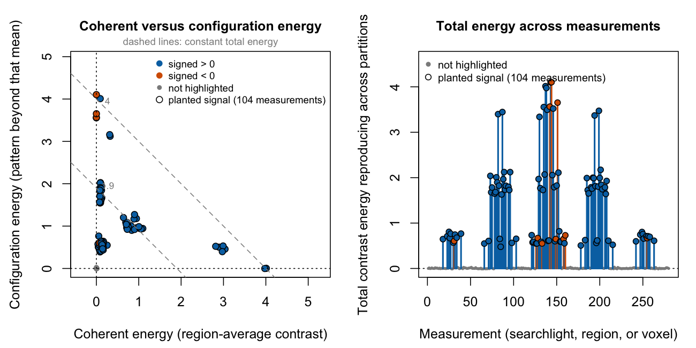
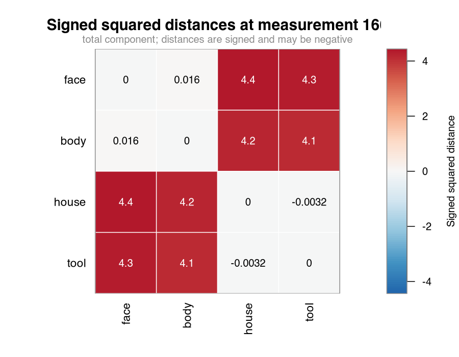

# crossform

[Get started](https://bbuchsbaum.github.io/crossform/articles/introduction.html) ·
[Vignettes](https://bbuchsbaum.github.io/crossform/articles/index.html) ·
[API reference](https://bbuchsbaum.github.io/crossform/reference/index.html) ·
[Examples](exemplars/)

Crossform is an R package for studying representations with univariate
contrasts, multivariate distances, and representational similarity analysis
(RSA). It measures effects that reproduce across independent runs and separates
the contribution of a region's average response from its spatial pattern.

These readings share a declared geometry: the same condition effects, spatial
measurements, partition pairing, and neural metric. You can change the question
without refitting the condition effects.

**Status:** Experimental development package; APIs may change.

## Install

These guides follow the `elite-pass` development branch, currently proposed in
[PR #3](https://github.com/bbuchsbaum/crossform/pull/3). Install that version
from GitHub. Building from source requires an R toolchain with a C++ compiler.

```r
# install.packages("remotes")
remotes::install_github("bbuchsbaum/crossform", ref = "elite-pass")
```

The [online vignettes](https://bbuchsbaum.github.io/crossform/articles/index.html)
need no installation. For an offline copy, add `build_vignettes = TRUE` to the
installation call; this also requires Pandoc and the vignette dependencies.

## A first result

The built-in example has four conditions, four runs, and 280 searchlights.
Each searchlight is one spatial measurement and produces one row of results.

```r
library(crossform)
example <- example_fmri_effects()

plan <- plan_geometry(
  example$fit$relation,
  at = example$frame,
  over = cross_partitions(
    example$fit$relation,
    independence = "independent",
    generalizes_over = "run"
  )
)
effect <- contrast_energy(plan, example$contrast)
plot(effect, highlight = example$truth$signal_measurements,
     highlight_label = "planted signal")
```



The simulation plants two effects with similar total energy. One shifts nearby
voxels in the same direction; the other varies across voxels. The left panel
separates them, while the right shows their total energy.

```r
round(as.data.frame(effect)[c(144, 137),
  c("signed", "coherent", "configuration", "total")], 3)
#>     signed coherent configuration total
#> 144 -0.052   -0.001         4.104 4.103
#> 137  2.003    4.011         0.004 4.015
```

- **`signed`** is the ordinary contrast of the weighted mean response.
- **`coherent`** is the crossvalidated energy in that spatial mean mode.
- **`configuration`** is the crossvalidated energy beyond the mean mode.
- **`total`** is their sum: `coherent + configuration = total`.

Searchlight 144 has a strong spatial pattern with little average response;
137 has a strong average response. The decomposition depends on the declared
spatial frame, so it describes the effect at that measurement and scale.

Crossvalidated energy can be negative. Under the required independence
assumptions, a null effect has expected energy zero; the observed band around
zero is not a significance threshold. `coherence_fraction` is reported only
when the components form a valid nonnegative partition.

The example supplies independent simulated errors. With your own data,
`independence = "independent"` is an assumption about estimation errors, not a
guarantee created by run labels. Shared preprocessing or training can couple
runs. `generalizes_over` records whether the pairing represents runs, sessions,
or another declared axis.

## Read the same geometry in other ways

An RDM reports signed crossvalidated squared distances between conditions:

```r
peak <- which.max(effect$total)
distances <- rdm(plan)
plot(distances, measurement = peak)
```



Fixed linear RSA fits model RDMs using the same plan:

```r
category <- rsa(plan, models = list(category = example$model_rdm))
dim(category$coefficients)
#> [1] 280   2
```

The two columns are the intercept and category-model coefficient. If you need
only selected distances, request those pairs directly:

```r
one_pair <- rdm(plan, pairs = rbind(c("face", "house")))
dim(one_pair$values)
#> [1] 280   1
```

Each view evaluates its requested geometry query. The first-level effects are
reused, and an unused full RDM need not be materialized. `rdm()` uses squared
Euclidean distance, or squared Mahalanobis distance with a suitable fixed
metric; [pattern correlation](https://bbuchsbaum.github.io/crossform/articles/correlation-distance-policy.html)
answers a different question.

## Uncertainty needs an error model

The example retains a fitted residual error channel. On this admitted design,
it supports within-searchlight standard errors under a declared null target:

```r
round(sqrt(sampling_covariance(
  rdm_sampling_covariance(plan, example$fit, target = "null", at = peak)
)), 4)
#>  face - body face - house  face - tool body - house  body - tool house - tool
#>       0.0142       0.0142       0.0142       0.0142       0.0142       0.0142
```

These rely on the supported partition, metric, and error-covariance assumptions.
They do not account for choosing the peak, spatial multiplicity, or population
variation. Imported beta matrices alone do not supply the residual channel.
The [observation-to-effects guide](https://bbuchsbaum.github.io/crossform/articles/from-observations.html)
shows how to retain it; the [failure gallery](https://bbuchsbaum.github.io/crossform/articles/failure-gallery.html)
explains unavailable results and their remedies.

## Choose your next step

All 15 vignettes are available as rendered articles. The
[article index](https://bbuchsbaum.github.io/crossform/articles/index.html)
groups them by task; their [R Markdown sources](vignettes/) are also on GitHub.

| Task | Guide |
|---|---|
| Follow the first analysis | [Introduction](https://bbuchsbaum.github.io/crossform/articles/introduction.html) |
| Interpret energy, sign, and spatial scale | [Reading results](https://bbuchsbaum.github.io/crossform/articles/interpreting-results.html) |
| Fit effects from responses and events | [From observations](https://bbuchsbaum.github.io/crossform/articles/from-observations.html) |
| Work with brain volumes | [neuroim2 data](https://bbuchsbaum.github.io/crossform/articles/neuroim2-data.html) |
| Migrate an existing analysis | [From rMVPA](https://bbuchsbaum.github.io/crossform/articles/from-rmvpa.html) |
| Compare spatial effect types | [Matched interpretability](https://bbuchsbaum.github.io/crossform/articles/matched-interpretability.html) |
| Account for overlapping measurements | [Conservative frames](https://bbuchsbaum.github.io/crossform/articles/conservative-frames.html) |
| Learn a form and test independent prediction | [Predictive geometry](https://bbuchsbaum.github.io/crossform/articles/predictive-geometry.html) |
| Relate two sets of measurements | [Evidence pairing](https://bbuchsbaum.github.io/crossform/articles/evidence-pairing.html) |
| Model participant geometries | [Population forms](https://bbuchsbaum.github.io/crossform/articles/population-form.html) |
| Choose magnitude or pattern correlation | [Correlation and distance](https://bbuchsbaum.github.io/crossform/articles/correlation-distance-policy.html) |
| Diagnose an unsupported request | [Failure gallery](https://bbuchsbaum.github.io/crossform/articles/failure-gallery.html) |
| Follow the shared algebra | [Common geometry](https://bbuchsbaum.github.io/crossform/articles/common-geometry-equivalence.html) |
| Examine claims and their evidence | [Novelty and boundaries](https://bbuchsbaum.github.io/crossform/articles/novelty.html) |
| Build an adapter | [Extending crossform](https://bbuchsbaum.github.io/crossform/articles/crossform-extending.html) |

With vignettes installed, the same guides are available offline:

```r
vignette("introduction", package = "crossform")
```

## Scope and evidence

Crossform accepts condition effects or fits them from observations. Spatial
frames support searchlights, regions, voxels, and whole-domain measurements.
For model-supported prediction, it learns a regularized low-rank form on
training data and measures signed predictive gain on independent data with
the same conditions. The fitted PSD form is a separate, biased latent estimate;
it does not replace the signed crossvalidated geometry.

Measurement coupling and population analysis are experimental. Coupling has
bounded small-node support. Population intervals are pointwise and conditional
on declared transport and coverage; they do not include uncertainty from
learning that transport or arbitrary missingness. Crossform does not replace
image preprocessing, registration, or general spatial multiple-testing tools.

Numerical equivalence is checked with independent oracles and
[version-pinned rsatoolbox comparisons](exemplars/rsatoolbox-parity/).
[Real-data exemplars](exemplars/) illustrate workflows;
[benchmark receipts](benchmarks/) record workload-specific runtime and memory.
These establish bounded computational evidence, not universal performance or
neuroscientific claims. See the
[evidence ledger](design/evidence-status-ledger.md) and
[design contracts](design/) for the assumptions behind each claim.

## License

MIT. See [LICENSE](LICENSE).
